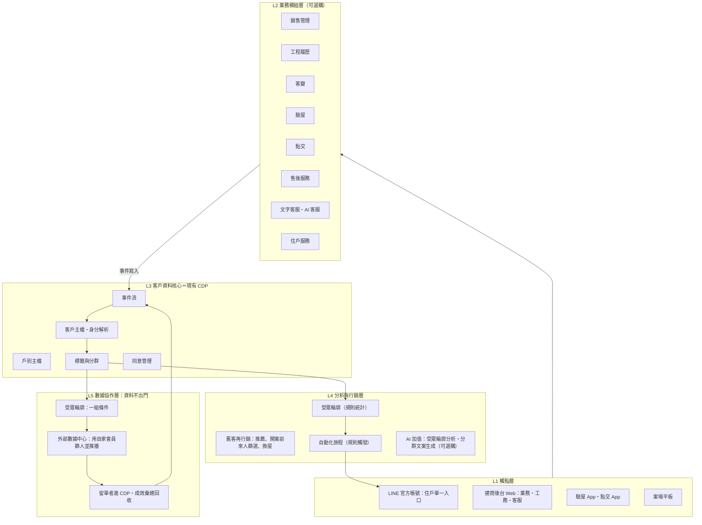

# 不動產客戶價值中心 架構規劃 v2

> 新合達內部規劃稿 ｜ 2026-09-09 ｜ 配套心智圖：`客戶價值中心_心智圖_v2.html`（瀏覽器開啟，可展開收合）
> 本稿是「方向對齊版」，先定骨架與切法，數字與時程都是建議值，範圍確認後再展成產品規格。

---

## 0. 一頁摘要

**要做的事**：把新合達現有的獨立產品（銷售管理、工程履歷、客變、驗屋 app、點交 app、售後服務、CRM/CDP、LINE 串接）併成一個私有雲平台。建商可以只買需要的模組，但所有模組都寫進同一份客戶主檔。

**背景與時機**：第七波選擇性信用管制後，建商與代銷只為兩件事付錢：直接帶來成交、省下無效廣告費。分散的系統各存一份客戶資料，做不到「從成交客與舊客裡找真買方」，也做不到「交屋後的住戶變成下一案的客源」。

**核心設計**：以「一戶一人」為主鍵，客戶從來人到住戶的每一個接觸點都寫進同一條時間軸。行銷不再從外面買流量，而是先在自己的資料庫算出真買方的輪廓，再付費請外部數據中心用它的第一方會員去推。

**三個原則**
1. 模組可單買，現有 CDP（客戶資料核心）與 LINE 入口是底座，一律隨附。
2. 現有系統照用、不改寫。第一步把各系統的資料接進現有 CDP，CDP 是那份單一客戶主檔；資料到齊後，第二步再把登入與 LINE 入口統一，最後才把畫面收進同一個平台。
3. 私有雲部署，建商的客戶資料留在私有雲內，不對外流出。對外只送「受眾輪廓」這組條件，由外部數據中心用自己的第一方會員推播，建商付費使用。


---

## 1. 規劃前提

| 面向 | 前提 |
|---|---|
| 市場 | 買方觀望、來客量降、貸款成數是簽約最大變數。建商推案週期拉長，更重視已購客與舊名單。 |
| 客戶 | 主客群是建商（要跨案永續經營住戶關係），次客群是代銷（要單案快速去化）。兩者共用同一平台，只是買的模組組合不同。 |
| 我們 | 除工程履歷外，其他模組都有現成產品，web 與 app（驗屋、點交）都在線上，LINE 已有串接經驗。問題是各產品 UI 風格不同、彼此沒串，客戶在每個系統裡各是一筆。 |
| 部署 | 建商普遍要求資料留在自己環境，因此以私有雲為預設，我方託管為選項。 |
| 法規 | 個資法「特定目的內利用」與「告知同意」是邊界。建商資料不出門就沒有名單交換問題；外部推播的對象是數據中心自己取得同意的會員。 |

---

## 2. 客戶價值週期：平台的骨架

平台不按「系統」排，按「客戶走到哪一步」排。八個階段如下，每個階段對應一組模組、一批要留下的資料。

| # | 階段 | 客戶在這一步在意什麼 | 建商在這一步要什麼 | 對應模組 | 必留資料（寫進客戶主檔） | 主要觸點 |
|---|---|---|---|---|---|---|
| 1 | 來人／潛客 | 買不買得起、貸得下來嗎 | 分辨真買方、少打無效電話 | 銷售管理（來人登錄、需求紀錄）、CDP 篩選 | 手機、LINE UID、需求坪數／總價、自備款區間、名下有無房產 | 案場平板、LINE 加好友 |
| 2 | 成交／簽約 | 付款排程、貸款配套 | 銷控與付款進度可控 | 銷售管理（銷控、付款） | 戶別、總價、貸款成數、共同持有人 | 建商後台、LINE 通知 |
| 3 | 工程期 | 蓋到哪了、品質看得到嗎 | 減少來電詢問、累積信任 | 工程建造履歷（新建） | 工程節點、照片、驗收紀錄（對應到戶） | LINE 推播與 LINE 內頁面 |
| 4 | 客變 | 改得成嗎、要加多少錢 | 變更單不漏、成本可追 | 客變管理 | 客變項目、金額、簽認紀錄 | 建商後台、LINE 簽認 |
| 5 | 驗屋 | 瑕疵有沒有修好 | 缺失閉單有據、減少爭議 | 驗屋 app | 缺失項目、照片、複驗結果 | App、LINE 進度 |
| 6 | 點交／交屋 | 拿到什麼、保固怎麼算 | 一次交清、資料落地 | 點交 app | 點交清單、保固起算日、設備清冊 | App、LINE 電子文件 |
| 7 | 售後／保固 | 報修方便、多快修好、問了有人回 | 維修成本可控、滿意度可量、客服人力可控 | 售後服務（報修、保固、清潔）、文字客服、AI 客服 | 報修紀錄、處理時效、滿意度、客服對話摘要 | LINE 表單與 LINE 內頁面、LINE 對話 |
| 8 | 住戶生活／再行銷 | 生活服務、下一次換屋 | 住戶推薦、二代置產、下一案客源 | CDP 進階、自動化旅程、住戶服務 | 換屋訊號（由互動行為推得，不另收個資）、互動紀錄、推薦紀錄 | LINE OA、EDM |

第 6 步「點交」是建商取得住戶 LINE、住戶加好友意願最高的時間點，是整條週期的資料落地點，也是第 5 節建議的整併起點。

---

## 3. 平台整體架構（五層＋一個底座）

```
┌─────────────────────────────────────────────────────────────────┐
│ L1 觸點層     LINE OA（住戶單一入口）｜ 建商後台 Web ｜ 驗屋 App ｜ 點交 App ｜ 案場平板 │
├─────────────────────────────────────────────────────────────────┤
│ L2 業務模組層（可選購）                                             │
│   銷售管理 ｜ 工程履歷 ｜ 客變 ｜ 驗屋 ｜ 點交 ｜ 售後服務 ｜ 文字客服・AI 客服 ｜ 住戶服務 │
├─────────────────────────────────────────────────────────────────┤
│ L3 客戶資料核心＝現有 CDP（必備底座）                                 │
│   客戶主檔（身分解析）｜ 戶別主檔 ｜ 事件流 ｜ 標籤與分群 ｜ 同意管理    │
├─────────────────────────────────────────────────────────────────┤
│ L4 分析與行銷層（規則為主）＋ AI 加值（可選購）                          │
│   受眾輪廓 ｜ 舊客再行銷 ｜ 自動化旅程 ｜ AI：輪廓交叉特徵・分群文案・AI 客服 │
├─────────────────────────────────────────────────────────────────┤
│ L5 數據協作層（資料不出門，只送輪廓）                                  │
│   受眾輪廓 ｜ 條件單送出 ｜ 外部數據中心篩人推播 ｜ 留單進 CDP・成效彙總  │
├─────────────────────────────────────────────────────────────────┤
│ 共用基礎   一建商一套或多家隔離 ｜ 帳號權限 ｜ 統一接口 ｜ 操作紀錄 ｜ 安裝包 │
└─────────────────────────────────────────────────────────────────┘
```



### 各層說明

**L1 觸點層**：住戶端只有 LINE 一個入口，工程進度、客變簽認、報修、保固查詢都做成 LINE 內的頁面，不另外做住戶網站。原則是「一個建商一個 LINE 官方帳號」，各案用選單與標籤區分，不要一案一帳號，否則住戶交屋後就斷線。Web 只給建商內部人員（業務、工務、客服）當後台。App 維持現有的驗屋、點交兩支，登入改走平台統一帳號。

**L2 業務模組層**：現有產品各自成為一個模組。模組之間不直接互相呼叫，一律透過 L3 的事件流交換資料。這樣才做得到「單買一個模組也能運作」。

**L3 客戶資料核心**：就是現有的 CDP，不另建新系統，是整個平台裡不可選購的必要底座。以下五項是 CDP 在平台裡要扛的角色，其中三項要對照 CDP 現況確認是否已具備：戶別主檔（一人多戶、一戶多人）、讓其他系統寫入事件的介面、身分合併是否納入 LINE UID。已有就直接用，沒有就是擴充 CDP，不是新系統。
- 客戶主檔：同一個人在各系統只算一筆。用手機號認人，LINE UID、Email 輔助比對。同一人在來人表、銷控表、報修單裡都收成一筆。
- 戶別主檔：案、棟、樓、戶、坪數、總價、交屋日、保固起算日。客戶與戶別是多對多（共同持有、換手）。
- 客戶時間軸（事件流）：每個模組發生的事都記一筆（誰、何時、哪戶、做了什麼）。L4 的輪廓、篩選與旅程都靠它。
- 標籤與分群：靜態屬性（首購、自營商、持有年數）加動態行為（近 30 天點擊、報修頻率）。
- 同意紀錄：每位客戶同意過哪些用途，決定 L5 能不能拿他做比對。

**L4 分析與行銷層**：吃 L3 的資料，做兩件事：把舊客算成受眾輪廓拿去找新客，以及對舊客再行銷。主體用規則就能做，AI 放在加值項目。

| 功能 | 第一版做法 | 需要 AI 嗎 |
|---|---|---|
| 受眾輪廓 | 規則統計：成交客與未成交來人在年齡帶、地緣、總價帶、首購比例等欄位的分佈差異，寫成條件單 | 不需要。AI 版找交叉特徵，列在加值 |
| 舊客再行銷 | 規則：已購客推薦、開案前依地緣與預算篩歷年來人、交屋滿 N 年的換屋名單 | 不需要 |
| 自動化旅程 | 規則觸發：進入某階段或點了某訊息，就發下一則 | 不需要 |
| AI 加值：輪廓交叉特徵分析 | 在成交客與未成交來人的規則統計之上找交叉條件，寫進條件單（第 6 節的輸入） | 需要。可選購，不買不影響前三項 |
| AI 加值：分群文案生成 | 依輪廓與階段產生 LINE 圖卡文案，人審後才發 | 需要。可選購 |
| AI 加值：AI 客服 | 現有產品，接上 CDP 後認得出住戶是哪戶 | 需要。現有產品，屬服務包 |

先讓建商看到輪廓報告與外部推播的留單數，比演算法精不精重要。舊客與新客的分工見第 7 節。

**L5 數據協作層**：把 L3 分群的結果歸納成「受眾輪廓」（一組條件），送給合作數據中心。對方用自己的第一方會員篩人並推播，建商付費。有人留單或加 LINE 才進建商 CDP。建商的資料在這一層留在原地，不會送出去。詳見第 6 節。

**共用基礎**：所有模組都踩在這一層上。

| 項目 | 說明 |
|---|---|
| 一建商一套／多家共用 | 預設每家建商裝自己一套；若由我方代管，多家共用一套程式但資料互相隔開 |
| 帳號權限 | 誰能登入、能看哪幾個案、能改什麼 |
| 統一接口 | 各模組與 LINE、外部數據中心進出的單一門口，方便管控與換模組 |
| 操作紀錄 | 誰在何時看過、匯出過哪些客戶資料，個資稽核用 |
| 安裝包 | 裝進建商機房或雲端的一鍵安裝，含升版 |

---

## 4. 模組化與選購方式

### 模組包

| 包 | 內含模組 | 主要買家 | 買它解決什麼 |
|---|---|---|---|
| 基礎底座（必附） | 現有 CDP（客戶資料核心）、LINE 入口、帳號權限、私有雲部署 | 所有客戶 | 所有模組資料進同一份主檔 |
| 銷售包 | 銷售管理（來人、銷控、付款）、開案前歷年來人篩選 | 建商業務部、代銷 | 開案前先有一批留過資料的人可以聯絡 |
| 工程包 | 工程履歷（新建）、客變 | 建商工務、客服 | 減少工程期詢問，客變金額不漏 |
| 交屋包 | 驗屋 App、點交 App | 建商工務、客服 | 缺失閉單有據，交屋一次落地資料 |
| 服務包 | 售後服務、保固、文字客服、AI 客服、住戶服務 | 建商客服 | 報修時效可量，滿意度變成資料，客服認得出住戶是哪戶 |
| 成長包 | CDP 進階分群、自動化旅程、受眾輪廓輸出與外部推播對接；AI 加值（受眾輪廓分析、分群文案生成）為加購項 | 建商行銷、代銷 | 住戶變下一案客源，付費用外部第一方受眾精準推播 |

### 模組的資料契約

每個模組上架平台的條件，是定義清楚它「必須寫進事件流的事件」。第一版事件字典見附錄 A。沒有事件契約的模組不算整合，只是掛在同一個入口。

### 收費結構（方向，數字另議）

- 底座：年費，按建商規模分級。
- 模組：按模組年費加「在售案場數」或「管理戶數」計價。銷售包按案場、服務包按戶數。
- 成長包：年費加用量（推播則數、比對受眾規模）。
- 數字不在本稿決定。

---

## 5. 現有產品到平台的整併路徑

### 現況盤點

| 模組 | 現況 | 載體 | 整併時要做的事 |
|---|---|---|---|
| 銷售管理（來人、銷控、付款） | 有現成產品 | Web | 接同步程式；後台換統一風格 |
| 工程建造履歷 | 沒有，要新建 | 建商後台 Web＋LINE 內頁面 | 排在第 ④ 步，現有產品整併完成後再新建；直接在平台站台開發，第一版就採統一風格 |
| 客變 | 有現成產品 | Web＋LINE 簽認 | 接同步程式；LINE 頁面換統一風格 |
| 驗屋 | 有現成產品 | App | 接同步程式；登入改平台帳號 |
| 點交 | 有現成產品 | App | 接同步程式；登入改平台帳號；點交時引導住戶加 LINE |
| 售後服務（報修、保固、清潔） | 有現成產品 | LINE 表單＋Web 後台 | 接同步程式；LINE 頁面換統一風格 |
| 文字客服 | 有現成產品 | LINE 對話＋Web 後台 | 接同步程式；客服畫面顯示 CDP 時間軸，一看就知道對方是哪戶、報修到哪一步 |
| AI 客服 | 有現成產品 | LINE 對話 | 接 CDP 後能認人；回答時帶入該戶的工程進度、報修狀態 |
| CRM／CDP | 有現成產品 | Web | CDP 直接當 L3 客戶資料核心；確認戶別維度、事件寫入介面、LINE UID 合併三項是否已具備 |
| LINE 串接 | 有 | LINE 官方帳號 | 收成一個帳號、一套選單 |

三個共同問題：UI 風格各異、彼此沒串、客戶在每個系統各是一筆。解法分四步，前三步處理現有產品，第四步新建工程履歷。每一步都寫清楚團隊實際做什麼、使用者會看到什麼改變、結束時能賣什麼。另外一件事是 **UI 風格一致**：第 ① 步先定一套版型與元件（色彩、字體、按鈕、LINE 選單與圖卡樣式），第 ② 步起所有 LINE 頁面直接用這套，第 ③ 步舊後台在重做時才換，第 ④ 步新建的工程履歷從第一版就採用。不一次把所有舊畫面換皮，因為那會讓所有系統同時停工。

### 第 ① 步：各系統接進 CDP，畫面不動（第 0 到 3 個月）

| 項目 | 內容 |
|---|---|
| 團隊做什麼 | 1. 以現有 CDP 為客戶主檔，先盤點三件事：有沒有戶別維度、有沒有讓其他系統寫入事件的介面、身分合併是否納入 LINE UID。缺的補進 CDP。<br>2. 寫一張欄位對照表：驗屋 app、點交 app、售服系統各自的客戶欄位，對到 CDP 的哪一欄。<br>3. 在這三個系統各加一支同步程式：每次存資料，同時把「誰、哪戶、何時、做了什麼」寫進 CDP。<br>4. 在 CDP 加一個查詢頁：輸入手機號，看到這個人跨系統的時間軸。<br>5. 定出一套 UI 版型與元件（一份設計稿），之後新做或重做的畫面都長這樣。 |
| 使用者看到什麼 | 現場工務、客服、住戶操作方式不變，照原本的 app 與系統走。內部只多一個查詢頁。 |
| 案例 | 住戶甲 3 月 1 日點交、3 月 15 日在 LINE 報修，客服在查詢頁輸入手機號，兩筆紀錄排在同一條時間軸上，不用分別開兩個系統查。 |
| 試點 | 挑一家近期有交屋案的建商，從該案交屋期開始跑。 |
| 結束時能賣 | 「交屋包＋服務包＋共用基礎」：住戶從點交起就進主檔，報修與保固串起來。 |

#### 畫面不動，資料怎麼接進 CDP：兩種接法

改的是各系統的後端程式，不是使用者看到的畫面。

| 接法 | 怎麼做 | 使用者感受 | 用在哪 |
|---|---|---|---|
| 後端加一支「寫出」程式 | 驗屋 app 存缺失單的那一刻，後端多做一件事：把「誰、哪戶、時間、做了什麼」送到 CDP 的接收介面，畫面、按鈕、流程不變。 | 操作不變 | 驗屋、點交、售服、客服。四個都是自家產品、有原始碼，直接用 |
| 排程批次同步 | 一支排程每 15 分鐘或每晚去讀各系統資料庫的新增與異動，轉成事件寫進 CDP。連系統程式都不碰，只讀它的資料庫。 | 操作不變，但資料延遲 15 分鐘到 1 天 | 歷史資料一次回填；沒有原始碼或第三方系統時的備案 |

即時性有差。自動化旅程要的「住戶點了圖卡就通知業務」，靠第一種才做得到。所以第一種是主線，第二種只用來回填歷史。

前提是 CDP 要有「讓其他系統寫入事件」的介面，這是第 1 個月盤點的三件事之一。有就直接用；沒有就先在 CDP 補這一支介面，其他系統的寫出程式才有地方送。

#### 第 2 個月逐週工作

| 週 | 工作 | 產出 |
|---|---|---|
| 第 1 週 | CDP 事件接收介面就位（盤點若已有就是零工）；欄位對照表定稿 | 四個系統各一張「我的欄位對到 CDP 哪一欄」 |
| 第 2 週 | 用批次把過去的來人、成交、點交、報修紀錄一次倒進 CDP | 身分合併結果：同一人在不同系統被合成一筆的比率 |
| 第 3 週 | 四個系統後端各加一支寫出程式，測試環境跑通 | 在測試環境驗一次屋、報一次修，CDP 時間軸就多一筆 |
| 第 4 週 | 試點建商交屋案正式跑 | 工務照舊用驗屋 app，客服照舊用售服後台，新增的只有 CDP 那一頁查詢頁，輸手機號看時間軸 |

**點交時取得住戶 LINE**：點交是建商拿到住戶 LINE 的時間點，第 ① 步不改 app 畫面也要做到。

| 時點 | 做法 | 改不改 app |
|---|---|---|
| 第 ① 步（0 到 3 個月） | 點交人員帶實體 QR code 卡片或立牌，點交完成時請住戶掃碼加 LINE 官方帳號；加入後由 CDP 用手機號對回該戶 | 不改 |
| 第 ③ 步舊畫面重做時 | 把 QR code 與「已加入」狀態做進點交 app 的完成畫面，實體卡片退場 | 併入既有重做，不另外發版 |

### 第 ② 步：一組帳號、一個 LINE（第 3 到 6 個月）

| 項目 | 內容 |
|---|---|
| 團隊做什麼 | 1. 建商員工改用一組帳號登入所有系統（單一登入）。<br>2. 住戶端統一成一個 LINE 官方帳號：工程進度、客變簽認、報修、保固查詢全部掛進 LINE 選單，不再有分散的連結。<br>3. 銷售管理與客變系統也接上同步程式，來人與成交資料進主檔。<br>4. 受眾輪廓第一版：用試點建商的成交客與歷年來人算出條件單，供第 ③ 步送外部數據夥伴。<br>5. 開案前歷年來人篩選：新案開案前依地緣與預算篩一次，潛銷期每週更新。 |
| 使用者看到什麼 | 行銷主管：後台有一頁輪廓報告，看得到成交客的年齡帶、地緣、總價帶分佈。業務：新案開案前拿到一份歷年來人的聯絡名單，附上篩選原因。<br>住戶：只加一個 LINE，客變簽認、報修、保固查詢都在裡面辦。 |
| 案例 | 建商甲三個已完銷案的成交客中，62% 現居三個行政區內、71% 總價 1,500 到 2,000 萬、首購 55%。這三項寫成條件單，是下一案找新客的輪廓。開案前，歷年來人中符合這三項的 300 人列為第一批聯絡名單。（比例為示意） |
| 結束時能賣 | 加銷售包：開案前有名單，行銷有第一版輪廓。 |

### 第 ③ 步：新功能只做在平台站台上，舊畫面逐個退場（第 6 到 9 個月）

| 項目 | 內容 |
|---|---|
| 團隊做什麼 | 1. 從最少人用的舊畫面開始，在平台站台用統一風格重做一個，做完就關舊的。<br>2. 新需求一律只在平台站台開發，不再回頭改舊系統。<br>3. 完成第一家外部數據中心的技術對接，跑第一檔付費推播。 |
| 使用者看到什麼 | 建商內部人員逐步只剩一個後台，風格一致；住戶端沒有變化。 |
| 案例 | 售服舊後台第一個下線，客服改在平台後台處理報修。 |
| 結束時能賣 | 加成長包：跨案再行銷與外部推播。 |

### 第 ④ 步：新建工程建造履歷（第 9 到 12 個月）

工程履歷沒有現成產品，是四步中僅有的新開發。排在最後的原因：前三步把現有產品接起來就能開始收費，新開發的投入放在營收已經進來之後；而且到第 ④ 步時平台站台、統一風格、CDP 介面都已就位，工程履歷可以直接照既有規格做，不必回頭配合。

| 項目 | 內容 |
|---|---|
| 團隊做什麼 | 1. 直接在平台站台開發，資料透過 CDP 介面讀寫，第一版就採統一 UI 風格。<br>2. 工務在後台建立工程節點、上傳照片與驗收紀錄，對應到案、棟、戶。<br>3. 住戶在 LINE 選單看自己那一戶的進度與照片；每個節點完成時推播一則。<br>4. 工程事件寫進 CDP 時間軸，與客變、驗屋、點交接續。 |
| 使用者看到什麼 | 工務：多一個後台頁面登記節點與照片。<br>住戶：LINE 選單多一項工程進度，看得到自己那一戶蓋到哪一層、外牆與室內的照片。<br>客服：工程期的來電詢問減少，查詢頁上能看到該戶的工程狀態。 |
| 案例 | 住戶丁在 LINE 收到「12 樓結構體完成」的推播，點開看到自家樓層的照片與下一個節點的預計時間，不需來電詢問。 |
| 結束時能賣 | 加工程包：工程履歷與客變合為一包，涵蓋簽約到驗屋之間的整段工程期。 |

**「在平台上開發」是指什麼**：平台是一個獨立站台，裡面有建商後台與各模組的程式；CDP 是它底下的資料層。新模組寫在平台站台，透過 CDP 的介面讀寫資料，不把程式寫進 CDP 內部。理由有兩個：CDP 專職資料與分群，把報修、工程履歷這類流程功能塞進去會越來越胖，升版互相牽制；但也不是每個模組各自一個站台，那就回到現在各自為政的狀態。一個站台、一個資料層。

**選擇交屋包切入的理由**
1. 驗屋、點交已有 app，資料結構最完整，改動最小。
2. 點交是建商拿到住戶 LINE 的時點，也是住戶最願意加好友的時點。
3. 建商買單的第一個理由通常是「客服與交屋爭議」，比行銷更急。

---

## 6. 與外部數據中心的精準行銷機制

建商的客戶資料留在私有雲內，不會外送。出去的只有「受眾輪廓」，也就是一組條件。外部數據中心用它自己的第一方會員去找符合條件的人、自己推播，建商付費使用。

### 流程

| 步 | 在哪裡發生 | 做什麼 |
|---|---|---|
| 1 | 建商私有雲內 | 以成交客為正樣本、未成交來人為對照組，歸納真買方輪廓（做法見第 7 節），例如 30 到 45 歲、現居某三個行政區、首購或持有滿 8 年、可負擔總價 1,500 到 2,000 萬。 |
| 2 | 平台送出 | 把輪廓寫成一張條件單送給合作數據中心。裡面沒有名單、沒有手機號、沒有任何代碼。 |
| 3 | 數據中心內 | 數據中心在自己的會員裡篩出符合條件的人。 |
| 4 | 數據中心的管道 | 由數據中心用自己的 LINE、App、簡訊或廣告位推播建商的訊息。建商按觸達數或按檔期付費。 |
| 5 | 回到建商 | 收到訊息的人點擊、留單或加建商 LINE 官方帳號，這時才第一次進入建商 CDP，成為建商自己的第一方資料。 |
| 6 | 平台 | 觸達、點擊、留單數以彙總數字回報，寫回平台，用來修正下一輪輪廓。 |

### 分工

| 我們（平台） | 外部數據中心 |
|---|---|
| 算輪廓、送條件單、接回留單、量成效 | 篩人、推播、回報彙總數 |

### 設計理由

- 個資法：建商沒有任何個資出門，不涉及個資比對與名單交換的法律問題。對方推播的對象是對方自己取得同意的會員。
- 對建商：資料留在家，花的錢是「使用對方受眾」的費用，比大眾媒體便宜也準。
- 對我們：平台的價值在「輪廓算得準」。輪廓越準，外部觸達後的留單率越高，建商越願意續費。

### 合作數據中心的類型

選合作對象的思路是先問「真買方此刻人在哪裡、誰的會員名單裡有這群人」，再回推該找哪一類數據中心。以下用類型描述，不點名。

| 真買方此刻在做什麼 | 誰手上有這群人 | 對方能提供的條件與推播管道 | 優先順序 |
|---|---|---|---|
| 正在看房：查實價登錄、看格局圖、逛裝潢文章 | 房產平台、居家裝潢媒體 | 近 30 天看房行為、關注區域與總價帶；站內廣告位與會員推播 | 第一批，意圖最直接 |
| 住在新案附近，或每天在附近上班 | 電信業者 | 由基地台推得的居住地與工作地；簡訊與自家 App 推播 | 第一批，地緣是房產銷售的主要變數 |
| 家庭正在變大：結婚、生子、換大車、買家電 | 婚宴與月子中心、汽車與家電品牌會員、百貨與量販會員 | 家庭階段訊號、消費力區間；會員 App 推播、EDM | 第二批，換屋剛需的來源 |
| 已住在鄰近社區，屋齡到了換屋期 | 物業管理公司、社區服務 App | 社區住戶、屋齡、車位；社區公告推播 | 第二批，區域換屋族 |
| 手上有資金，考慮配置到房產 | 銀行理財、保險、券商 | 資產與貸款能力區間；理專與 App 通知 | 觀察，個資與金融法規門檻最高 |

以上各類是否接受條件單、怎麼收費，尚未向任何一家查證。第一家合作對象確定前，不向建商承諾外部推播的成效。

---

## 7. 舊客與新客的分工，以及 AI 放在哪

新舊客都重要，用途不同。舊客（成交客、歷年來人、住戶）有兩個用途：算出受眾輪廓拿去找新客，以及再行銷。新客靠外部數據夥伴用輪廓去找，找到的人留單後進 CDP，成為下一輪的舊客。

### 7.1 舊客用途一：算受眾輪廓

**資料來源**：成交客（簽約紀錄）是正樣本，未成交來人是對照組，住戶（點交後）補充居住與家庭階段的變化。全部來自 CDP 已有或第 ① 步接進來的資料，不新收欄位。

**條件單的欄位**

| 欄位 | 怎麼算 | 條件單裡長什麼樣 |
|---|---|---|
| 年齡帶 | 成交客年齡分佈中占比最高的區間 | 30 到 45 歲 |
| 地緣 | 成交客現居與工作地的行政區，取累計占比達六成的前幾區 | 現居或工作於 A、B、C 三區 |
| 總價帶 | 成交總價分佈的中間七成 | 可負擔總價 1,500 到 2,000 萬 |
| 首購或換屋 | 來人時自填的名下有無房產 | 首購為主，占 55% |
| 購屋動機 | 來人需求紀錄中的自住或置產 | 自住 |
| 看房行為 | 成交前看過幾案、來人到成交的天數 | 看過兩案以上、45 天內決定 |

**第一版做法**：規則統計。逐欄位比較成交客與未成交來人的分佈，差異最大的欄位排在條件單前面。這一版不需要 AI。

**AI 加值版**：用模型找交叉特徵，例如「30 到 40 歲、現居 B 區、看過兩案以上」這組人的成交率是平均的三倍，把這類交叉條件寫進條件單。屬可選購項目。

**送出與回流**：條件單經行銷主管審過後送數據夥伴，裡面沒有任何個人資料。外部推播帶進來的留單進 CDP 成為新來人，成交後回到正樣本，下一輪輪廓再算一次。

### 7.2 舊客用途二：再行銷

| 對象 | 做什麼 | 頻率 |
|---|---|---|
| 歷年來人（留單未成交） | 新案開案前依地緣與預算篩一次，列為潛銷期第一批聯絡名單；潛銷期每週更新一次，通話後回填結果 | 每案一次 |
| 已購客與住戶 | 推薦親友（推薦紀錄寫進 CDP，成交後回饋）；住戶服務內容維持互動 | 持續，低頻 |
| 交屋滿 7 到 10 年的住戶 | 列為換屋名單，新案若有對應總價帶再聯絡 | 每案一次 |

再行銷不做每日評分與分級。建商一年推一到兩案，名單在開案前產出即可。

### 7.3 新客：靠外部數據夥伴

流程在第 6 節。這裡只補一句：外部推播的成效以「留單進 CDP 的人數與成本」計，不以曝光數計。留單後的聯絡與到場，回到銷售管理的來人流程。

### 7.4 AI 加值項目

| AI 加值項目 | 做什麼 | 吃什麼資料 | 產出到哪 |
|---|---|---|---|
| 輪廓交叉特徵分析 | 在規則統計之上找交叉條件，寫進條件單 | CDP 標籤、成交與來人紀錄 | 第 6 節送外部數據夥伴 |
| 分群文案生成 | 依輪廓與所在階段產生 LINE 圖卡文案，人審後才發 | 標籤、階段、案資料 | 自動化旅程 |
| AI 客服 | 現有產品。接上 CDP 後認得出對方是哪戶，回答時帶入該戶的工程進度與報修狀態 | 客戶主檔、時間軸 | LINE 對話 |

規則能做的（輪廓統計、開案前篩選、旅程觸發）不叫 AI。AI 只做規則做不到的事：找交叉特徵、寫文案、對話。

---

## 8. 私有雲部署架構（技術方向）

| 項目 | 建議 |
|---|---|
| 部署型態 | 預設一建商一套實例（單租戶）。我方託管時同一套程式碼以租戶隔離。 |
| 打包方式 | 容器化，提供一鍵安裝包；小型建商用單機容器編排，大型建商可上 Kubernetes。 |
| 對外連線 | LINE Messaging API 的 webhook 需要公網位址，私有雲需開一條受控的對外通道或由我方代理轉發。 |
| 資料庫 | 客戶主檔與事件流分開：主檔用關聯式資料庫，事件流用可追加的儲存，方便 L4 批次運算。 |
| 平台站台與 CDP 的關係 | 平台是一個獨立站台（建商後台＋各模組程式），CDP 是資料層。模組透過 CDP 介面讀寫，不把流程程式寫進 CDP。 |
| App 後端 | 驗屋、點交 app 的後端改接平台 API，app 端只換登入與資料來源，不重寫。 |
| 資安與稽核 | 所有讀取客戶主檔的操作留紀錄；資料匯出需二階授權；對外只允許送出受眾輪廓條件，程式層擋掉任何個資欄位。 |
| 升版 | 私有雲最怕版本分岐。模組以版本化 API 對接，底座可獨立升版。 |

---

## 9. 商業模式與推進路線

**客群排序**：建商第一，因為客戶關係跨案、續約穩定；代銷第二，用銷售包加成長包切入。

**推進路線（12 個月）**

| 時間 | 里程碑 |
|---|---|
| 第 1 個月 | 盤點 CDP 三件事（戶別、事件介面、LINE UID 合併）；事件字典 v1；UI 版型定稿；選定試點建商 |
| 第 3 個月 | 驗屋、點交、售服、客服接進 CDP（第 2 個月完成）；試點建商的交屋案已運行一個月，修正欄位對照與身分合併規則 |
| 第 6 個月 | 統一 LINE 官方帳號與帳號系統；受眾輪廓第一版產出；開案前來人篩選可用；銷售管理與客變接入；銷售包開賣 |
| 第 9 個月 | 第一個舊後台換成統一風格並下線；自動化旅程上線；第一家數據中心對接完成並跑完第一檔付費推播；成長包開賣 |
| 第 12 個月 | 工程建造履歷第一版上線；工程包開賣；第二家建商上線 |

**時程的前提**：團隊全職投入，且 CDP 三件事已具備。若要補戶別維度或事件寫入介面，第 ① 步各加約 1 個月，後面順延。工程履歷排在最後，因為它沒有現成產品，先把現有產品接起來開始收費，再投入新開發。

**成效指標（給試點建商看的）**
- 交屋階段住戶 LINE 加好友率
- 報修平均處理時效
- 外部推播每一筆留單的成本，以及留單到場率
- 開案前歷年來人名單的接通率與到場率
- 舊客與住戶推薦占新案來人的比例

---

## 附錄 A：事件字典 v1（節錄）

| 事件 | 來源模組 | 必填欄位 |
|---|---|---|
| lead.registered 來人登錄 | 銷售管理 | 客戶 ID、案、需求坪數、總價區間、來源管道 |
| deal.signed 成交 | 銷售管理 | 客戶 ID、戶別、總價、貸款成數、共同持有人 |
| construction.milestone 工程節點 | 工程履歷 | 案、節點、日期、照片數 |
| change.requested / change.signed 客變申請／簽認 | 客變 | 戶別、項目、金額 |
| inspection.defect / inspection.closed 驗屋缺失／閉單 | 驗屋 | 戶別、項目、照片、複驗結果 |
| handover.completed 點交完成 | 點交 | 戶別、保固起算日、設備清冊、住戶 LINE UID |
| service.request / service.closed 報修／結案 | 售後服務 | 戶別、類別、處理時效、滿意度 |
| line.message.clicked LINE 訊息點擊 | LINE 入口 | 客戶 ID、訊息 ID、內容類型 |
| external.campaign.reported 外部推播成效 | 數據協作 | 輪廓 ID、管道、觸達數、點擊數、留單數 |

## 附錄 B：本稿沿用與未確認事項

- 沿用 vicki 口述：除工程履歷要新建，其他模組（銷售、客變、驗屋 app、點交 app、售後服務、CDP、LINE）都有現成產品，只是 UI 風格不同、沒串接。資料夾內能對到的文件是 CRM、CDP、行銷雲與驗屋標準檢查表；客變、點交的既有規格文件本次未找到，第 4 節與附錄 A 的模組欄位是依業務邏輯推的，需對照實際系統校正。
- 合約管理暫不納入平台範圍（vicki 2026-09-09 指示），銷售管理只含來人、銷控、付款。
- 不收集家庭成員等敏感個資（vicki 指示）；換屋訊號一律由互動行為推得。
- 住戶端只走 LINE，不做住戶網站（vicki 指示）。
- 外部數據中心的四種類型與可行性都未查證。
- 所有時程與價格為建議值。
